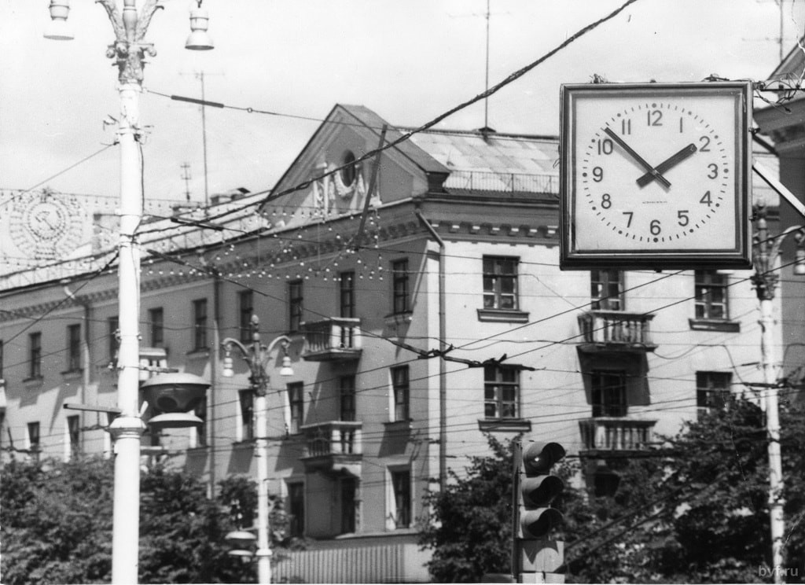
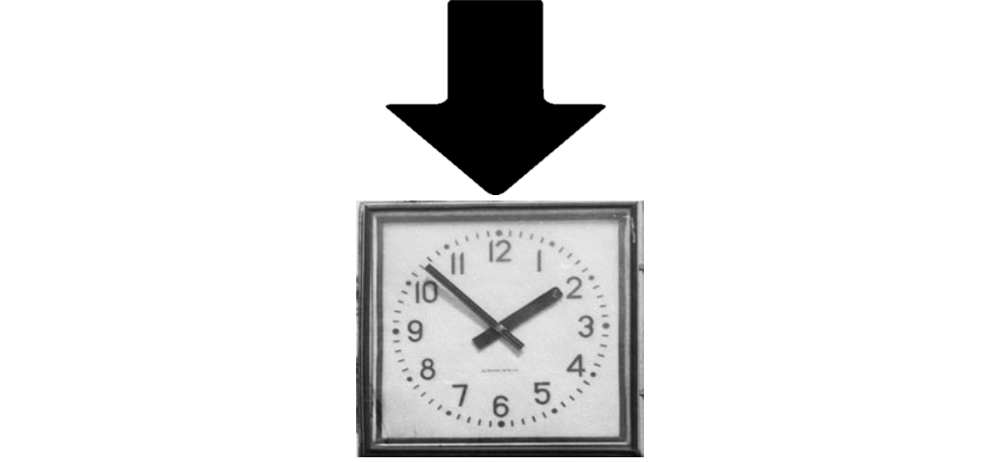

# Time_detector
Главная идея работы: "Как при помощи нейронной сети определять время по фотографии стрелочных часов?"  
На данный момент существуют два общих подхода, позволяющих решить такую задачу:  
1) Обучить нейросеть на большом количестве размеченных фотографий предсказывать время;
2) Детектирование положения стрелок на плоскости фотографии и последующий аналитический расчет времени.  

Мы попробовали оба этих подхода и сделали выводы о  том, какой подход лучше.
## Обучение нейросети

## Аналитический метод

