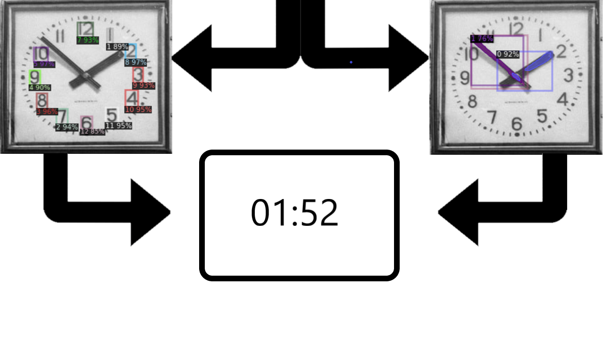

# Time_detector
Главная идея работы: "Как при помощи нейронной сети определять время по фотографии стрелочных часов?"  
На данный момент существуют два общих подхода, позволяющих решить такую задачу:  
1) Обучить нейросеть на большом количестве размеченных фотографий предсказывать время;
2) Детектирование положения стрелок на плоскости фотографии и последующий аналитический расчет времени.  

Мы попробовали оба этих подхода и сделали выводы о  том, какой подход лучше.
## Обучение нейросети

В качестве сети классификатора использовалась предобученная сеть ResNext50 с добавленным к ней полносвязным слоем на 720 выходов (60 минут * 12 часов).  
Датасет для обучения состоит из 200000 размеченных изображений часов. Из которых 16000 нарезаны по кадрам из видео разных часов, остальные часы сгенерированны функцией 
<a href="https://github.com/charigyang/itsabouttime"> SynClock. </a>  
Перед отправкой на сеть классификатора, каждое изображение поступает на предобученную на COCO сеть для локализации положения часов на изображении.   

  
Итоговый продукт представляет собой Телеграм-бота, которого вы можете запустить, если скачаете себе все файлы (кроме папки, посвященной аналитическому методу) и добавите в файл data.py свой API-токен.  

## Аналитический метод
Рассмотрим подробнее этапы детектирования времени в аналитическом методе:
1) При помощи предобученной на COCO сети "fаster_rcnn" детектируются часы на входном изображении. После этого они локализуются и отправляются на следующих этап;
2) Обрезанное изображение поступает на две сети:  
2.1  Модель для сегментации "mask_rcnn", обученная на 180 (до аугментации) изображениях часов с размеченными стрелками.  
Данная модель сегментирует стрелки на изображении. Далее из полученных масок методом наименьших квадратов определяются линейные уравнения стрелок. По уравнениям определяется точка их пересечения, которая принимается за центр часов. Помимо, этого находим координаты начала и конца стрелок и проводим проверку по длине (длина часовой стрелки должна быть меньше, чем длина минутной стрелки. В противном случае метки стрелок меняются);  
2.2 Модель для детекции положения чисел на циферблате "faster_rcnn", обученная на 180 (до аугментации) изображениях часов с размеченными числами.  
Данная модель детектирует числа на циферблате, далее выбирается наиболее вероятное число, которому соответствуют координаты центра сдетектированного прямоугольника. После этого, по уравнению окружности в сферической системе координат определяется положение чисел 12 и 3 на циферблате (зная метку класса первоначально полученного числа переходим к 12 и 3 поворотом координат числа, относительно центра окружности из п.2.1, на угол кратный 30 градусам);  
(*Замечание*. Из-за ошибок в метадате классы интерпретируются не интуитивно. Настоящие классы соотносятся так: {1: 1, 8: 2, 9: 3, 10: 4, 11: 5, 12: 6, 2: 7, 3: 8, 4: 9, 5: 10, 6: 11, 7: 0})  
3) Зная координаты центра окружности, чисел 12, 3 и концов стрелок определяем время по 4 углам (2 для минутной и 2 для часовой стрелки).  

  
Для того, чтобы попробовать модель в деле: запустите (легче все на Google Colab) ноутбук predict_time.ipynb и загрузите веса.

# Какая модель лучше?

На тестовом наборе данных, состоящем из 500 фотографий модели показали точность 58%, 51% (метрика accuracy) для первого и второго метода соответственно.  
Наиболее распространенные ошибки для обоих моделей:
 <ul>
 <li> Путают минутную и часовую стрелку; </li>
 <li> Принимают секундную стрелку за минутную или часовую. </li>
</ul>
Помимо этого, аналитическая модель часто неправильно находит обе стрелки или не находит какую-то стрелку совсем, что приводит к неправильному ответу или не дает ответ вовсе, поэтому для Телеграм-бота был выбран метод обученного классификатора.  

# Этот проект был выполнен за 10 дней:

<a href="https://github.com/PavelBogoslovskiy"> Pavel Bogoslovskiy </a>  
<a href="https://github.com/tano4ku"> Marina Polukoshko </a>  
 <a href="https://github.com/AdelGR"> Adel Gubaidullin </a>  
 <a href="https://github.com/tano4ku"> Yaroslav Efremov </a>

